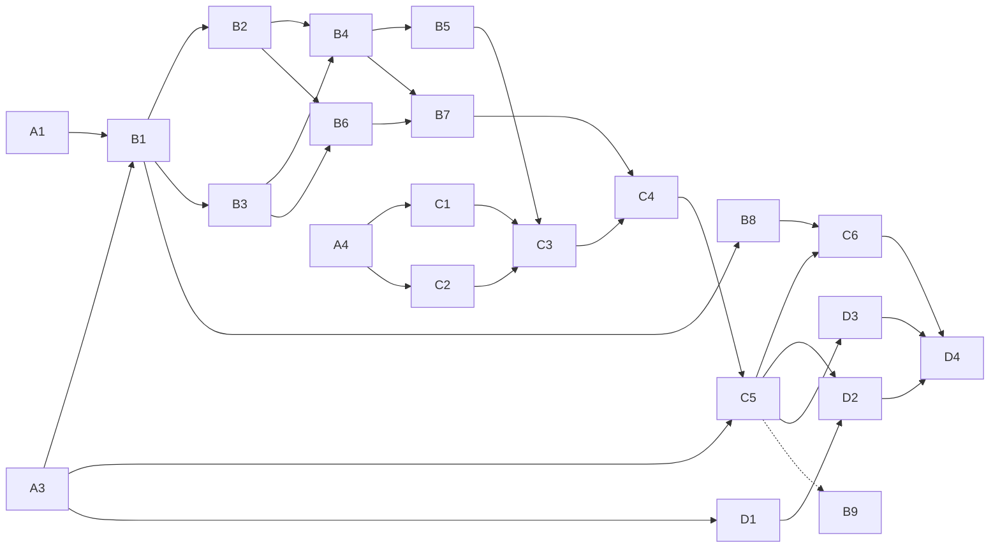

# SupportTools-ის ცენტრალიზებული რეესტრი SupportToolsServer-ზე

გეგმა შედგენილია 2026-10-01-ს, SupportTools-ისა და SupportToolsServer-ის კოდის ანალიზის საფუძველზე. ყოველი ამოცანის პრომპტი ცალკე ფაილშია, [tasks/](tasks/) საქაღალდეში. ამოცანის გაშვების წესი §8-შია.

## 1. მიზანი

SupportTools რამდენიმე კომპიუტერზე მუშაობს და ზოგიერთი პროექტი რამდენიმე კომპიუტერზეა. პროექტების აღრიცხვა (რეესტრი) ერთ ადგილას, SupportToolsServer-ზე, უნდა იყოს. SupportTools ყველა კომპიუტერზე ერთსა და იმავე გარემოს უნდა ხედავდეს: შეეძლოს ამ ინფორმაციის წაკითხვა, გამოყენება და შეცვლა.

**დასრულების კრიტერიუმი.** ახალ კომპიუტერზე საკმარისი უნდა იყოს ორი ნაბიჯი:
1. კომპიუტერის ლოკალური პარამეტრების შევსება: ფოლდერები, გზების mapping და სერვერთან დასაკავშირებელი ApiClient.
2. ერთი სინქრონიზაცია.

ამის შემდეგ იქაც უნდა გამოჩნდეს ყველა პროექტი, სერვერი, შაბლონი და საიდუმლო ფაილი. ერთ კომპიუტერზე გაკეთებული ცვლილება მეორეზე სინქრონიზაციით ჩნდება (ბოლოს ავტომატურად). ერთდროული ცვლილებები ერთმანეთს ჩუმად არ შლის.

## 2. ახლანდელი მდგომარეობა

### 2.1 SupportTools (კლიენტი)

**მდგომარეობის შენახვა**
- მთელი მდგომარეობა ერთ JSON ფაილშია (`--use`; მთავარ კომპიუტერზე `D:\1WorkSecurity\SupportTools\SupportTools.json`).
- `ParametersManager` მას ერთ, მთელ აპლიკაციაში გაზიარებულ `SupportToolsParameters` ობიექტად ტვირთავს. დაახლოებით 150 ადგილი ამ ობიექტს `(SupportToolsParameters)parametersManager.Parameters`-ით იღებს.
- `Save` მთელ ფაილს თავიდან წერს: არაატომურად და backup-ის გარეშე.

**რეალური მონაცემები**
- 61 პროექტი, 73 გიტ-რეპო, 268 `GitProjects` ჩანაწერი, 6 სერვერი, 42 ServerInfo.
- ყველა გზა აბსოლუტურია. ფესვებია `D:\1WorkDotnet`, `D:\1WorkPackages`, `D:\1WorkSecurity`, `D:\1WorkScaffoldSeeders`, `D:\1WorkMimosi`, `D:\1WorkLTG`, `D:\1WorkGPIH` და `D:\1WorkExperimental`.
- `Servers`-ში PAZISI-ც და Merinson-იც `IsLocal=true`-ა. ეს ველი კომპიუტერზეა დამოკიდებული და ასე ვერ გაზიარდება.

**საიდუმლოებები**
- ApiKey-ები, DB პაროლები, FileStorage-ის მონაცემები, `KeyGuidPart` და `MediatRLicenseKey` ფაილში ღიად ინახება.
- ფაილის დაშიფვრა კოდში გათიშულია. კომენტარის მიხედვით, იმიტომ, რომ „კომპიუტერებს შორის გადატანას შეუძლებელს ხდიდა“. ანუ დღეს ფაილი კომპიუტერებს შორის ხელით გადადის.

**სერვერთან ინტეგრაცია**
- ინტეგრაცია მხოლოდ სამ კოლექციაზეა: Gits, `.gitignore` შაბლონები და `.editorconfig` შაბლონები.
- ბრძანებები: `Sync Git Projects With SupportToolsServer...`, `Sync .gitignore files...` და `Sync .editorconfig files...`. სამივე დიფს აჩვენებს და Merge/Sync Up/Down-ს სთავაზობს.
- სერვერის რედაქტორები: „Support Tools Server Editor“ → `GitStsCruder`, `GitIgnoreFileTypesStsCruder`, `EditorConfigFileTypesStsCruder`.
- პროექტები, სერვერები, ServerInfo-ები, ApiClient-ები, DB კავშირები და დანარჩენი სერვერზე საერთოდ არ არის.

**ხელით გადატანა**
- ერთადერთი საშუალებაა `Export Project` / `Import Project`. ის აბსოლუტურ გზებს უცვლელად გადაიტანს, `ServerInfos`-სა და `AllowToolsList`-ს კი ასუფთავებს.
- ახალ კომპიუტერზე გარემოს აწყობა დღეს ათამდე ხელით შესასრულებელი ნაბიჯია.
- `Sync All Projects All Gits V2` ყველა რეგისტრირებულ პროექტს კლონავს, რადგან „ამ კომპიუტერზე არსებობის“ ცნება არ არსებობს.

### 2.2 SupportToolsServer

- Clean Architecture/CQRS. რეპოები: SupportToolsServer, SupportToolsServerCore, SupportToolsServerDbPart და SupportToolsServerShared. მიგრაციები ცალკე workspace-შია: `D:\1WorkDotnet\SupportToolsServerDbTools`.
- ცხრილები: `GitRepos`, `GitIgnoreFileTypes`, `EditorConfigFileTypes`. მიგრაცია ერთია, გაერთიანებული: `20260929190002_Initial`.
- 2026-10-01-დან GitRepo-ს დამატება ან შეცვლა domain event-ით სერვერზე `git clone/pull`-ს უშვებს `{AppOptions:WorkFolder}\Gits`-ში.
- **ყველა endpoint ანონიმურია**: `RequireAuthorization` კომენტარშია ან საერთოდ არ წერია. მოთხოვნის მონაცემებით შესაძლებელია:
  - `Gits` ფოლდერის გარეთ ფოლდერის წაშლა (`GitsWorkFolder.cs:45` ცვლის მხოლოდ `Path.DirectorySeparatorChar`-ს; `..` და ფესვიანი გზა გადის);
  - git-ის ოფციების ინექცია (`GitClient.cs:29` მისამართს ბრჭყალების გარეშე სვამს). → A2
- `SupportToolsServerDbTools.FakeHost` აღარ კომპილირდება: DbContext-ის ერთპარამეტრიანი კონსტრუქტორი წაიშალა. → A1
- `Program.cs`-ში `AddConfigurationEncryption` კომენტარშია. ამიტომ SupportTools-ის AppSettingsEncoder-ით დაშიფრულ appsettings-ს ახლანდელი build ვერ წაიკითხავს. → D1

### 2.3 რა აკლია

1. სერვერზე მოდელი და API ყველა საერთო კოლექციისთვის.
2. კლიენტში საერთო და კომპიუტერზე დამოკიდებული მონაცემების გამიჯვნა, ასევე გზების გარდაქმნა (Windows ↔ Linux).
3. სინქრონიზაციის ძრავა, რომელმაც იცის, რა სად შეიცვალა (ვერსიებით), და კონფლიქტებს აჩენს.
4. უსაფრთხოება: ავთენტიფიკაცია, შეყვანის ვალიდაცია და TLS, თუ სერვერი ინტერნეტიდან მისაწვდომია.
5. ცნება „პროექტი ამ კომპიუტერზეა / არ არის“ და ბრძანება „ჩამოიტანე პროექტი აქ“.

## 3. გადაწყვეტილებები

| # | გადაწყვეტილება | წყარო |
|-|-|-|
| G1 | სერვერის მოდელი **სრულად რელაციურია**. ყოველი საერთო კოლექცია ცალკე entity და ცხრილია. კავშირები FK-ებითაა: სერვერზე Id-ით, კონტრაქტში სახელით (როგორც დღეს `GitRepo` ↔ `GitIgnoreFileType`). ფასი: კლიენტის მოდელში ყოველი ახალი საერთო ველი ნიშნავს entity + configuration + migration + contract + mapping (§4.6). | მომხმარებელი, 2026-10-01 |
| G2 | საიდუმლოებები სერვერზე **ღიად** ინახება: ApiKey, DB და FileStorage პაროლები, `KeyGuidPart`, `MediatRLicenseKey` და 1WorkSecurity-ის ფაილები. შედეგები: (1) ავთენტიფიკაცია (A3) პირველი საიდუმლოს ატვირთვამდე უნდა ჩაირთოს; (2) თუ სერვერი LAN-ის გარეთაა, TLS სავალდებულოა; (3) საიდუმლო არ უნდა მოხვდეს ლოგში, Debug ტრეისში ან კონსოლში; (4) DB-ის backup-იც საიდუმლოა. | მომხმარებელი |
| G3 | არსებობს Linux კომპიუტერიც. სერვერზე გზები **კანონიკური** ფორმით ინახება: Windows-ის ფორმით, როგორც მთავარ კომპიუტერზე (PAZISI). თითო კომპიუტერს აქვს ლოკალური prefix-mapping და გამყოფების ნორმალიზაცია. გარდაქმნას სინქრონიზაციის ფენა აკეთებს (C1). | მომხმარებელი |
| G4 | სერვერის ჰოსტი (PAZISI LAN-ში თუ dl360 ინტერნეტიდან) ჯერ არ არის გადაწყვეტილი; წყდება D1-ში. მანამდე Dev ინსტალაცია PAZISI-ზეა. | მომხმარებელი |
| G5 | ლოკალური JSON რჩება სამუშაო ასლად და offline ქეშად. საერთო მონაცემების ჭეშმარიტების წყარო სერვერია. სინქრონიზაცია 3-მხრივია (ლოკალური / სერვერის / ბოლო სინქრონიზაციის მდგომარეობა), ჩანაწერის დონეზე, `Version`-ით (optimistic concurrency). ჯერ ხელით გამოსაძახებელი ბრძანება კეთდება (C5), ბოლოს ავტომატური სინქრონიზაცია (D2). | დიზაინი |
| G6 | კომპიუტერის ველები სერვერზე არ მიდის (§4.1). `ServerDataModel.IsLocal` კომპიუტერზე გამოითვლება ლოკალური `CurrentMachineServerName`-ით. ApiClient, რომლითაც SupportToolsServer-ს უკავშირდები (`SupportToolsServerWebApiClientName`), ლოკალური რჩება (bootstrap). | დიზაინი |
| G7 | აგრეგატები: Project-ის აგრეგატში შედის პროექტი, მისი ყველა შვილი კოლექცია და ServerInfo-ები. `Version` ერთია, აგრეგატის ფესვზე. ცვლილება ნიშნავს მთელი აგრეგატის ჩანაცვლებას. | დიზაინი |
| G8 | ჩანაწერები სახელით ემთხვევა, რეგისტრის გარეშე (როგორც დღეს Gits-ში). სერვერის Id კლიენტს არ სჭირდება და კლიენტის Id იგნორირდება. | არსებული პრაქტიკა |
| G9 | გამოთვლადი მონაცემები (`GitProjects`, DotnetTools-ის დაყენებული ვერსიები) არ სინქრონიზდება. სურვილისამებრ `GitProjects`-ს სერვერი თვითონ გამოითვლის (B9). | დიზაინი |

## 4. არქიტექტურა

### 4.1 რა მიდის სერვერზე

| კოლექცია / ველი | სერვერზე? | ამოცანა | შენიშვნა |
|-|-|-|-|
| `Projects` | დიახ, აგრეგატად | B6, B7, C4 | გზები კანონიკური ფორმით; `KeyGuidPart` ღიად |
| `Gits` | დიახ (უკვე არის) | B1, C3 | B1 ამატებს `Version`-ს |
| `GitIgnorePatterns`, `EditorConfigPatterns` და მათი ფაილები | დიახ (უკვე არის) | B1, C3 | შიგთავსი სერვერზეა, ლოკალურად ფაილებია შაბლონების ფოლდერში |
| `Servers` | დიახ, `IsLocal`-ის გარდა | B4, C3 | `IsLocal` = (სახელი == `CurrentMachineServerName`) |
| `Environments`, `RunTimes`, `NpmPackages`, `ReactAppTemplates` | დიახ | B1, B2, C3 | |
| `DotnetTools` | ნაწილობრივ: `PackageId`, `MaxVersion`, `Description` | B2, C3 | `InstalledVersion`, `LatestVersion`, `CommandName` კომპიუტერისაა |
| `SmartSchemas`, `FileStorages`, `ApiClients`, `DatabaseServerConnections` | დიახ, საიდუმლოებებით | B3, C3 | bootstrap ApiClient ლოკალურია; ცალკეული ჩანაწერი შეიძლება სინქრონიზაციიდან გამოირიცხოს (C2) |
| `AppProjectCreatorAllParameters` და მისი `Templates` | დიახ | B5, C3 | `ProjectsFolderPathReal`, `SecretsFolderPathReal` კანონიკური გზებია |
| გლობალური საერთო ველები | დიახ | B5, C3 | `ServiceDescriptionSignature`, `UploadTempExtension`, ოთხი ნიღაბი/გაფართოება, `MediatRLicenseKey`, `FileStorageNameForExchange`, `SmartSchemaNameForExchange`, `SmartSchemaNameForLocal`, `LocalPackageManagerWebApiClientName`, `DatabasesBackupFilesExchangeParameters` (`LocalPath`-ის გარდა) |
| 1WorkSecurity-ის ფაილები, რომლებზეც რეესტრი მიუთითებს | დიახ, ღიად | B8, C6 | `ServerInfo.AppSettingsJsonSourceFileName` და სხვა |
| `GitProjects` | არა (გამოთვლადია) | B9 (სურვილისამებრ) | |
| `Archivers` | არა | — | კომპიუტერის exe გზებია; runtime-ში არავინ კითხულობს |
| კომპიუტერის ველები | არა | C1 | `SupportToolsServerWebApiClientName`, `LogFolder`, `LogGitWork`, `GitExecutablePath`, `WorkFolder`, `FolderForGitignoreFiles`, `FolderForEditorConfigFiles`, `TempFolder`, `CodeGenerateTestFolder`, `SecurityFolder`, `ScaffoldSeedersWorkFolder`, `PublisherWorkFolder`, `LocalInstallerSettings`, `RecentCommands*`. ახალი ველები: `MachineName`, `CurrentMachineServerName`, `PathMappings`, `RegistrySyncState` და ავტოსინქრონიზაციის ალამი |

### 4.2 სერვერის აგრეგატები

FK-ების წესი: მითითება სხვა აგრეგატზე `Restrict`-ია, ამიტომ მითითებული ჩანაწერის წაშლა 409 `RecordIsInUse`-ს აბრუნებს მომხმარებლების სიით. აგრეგატის შვილები `Cascade`-ით იშლება.

| აგრეგატი | ცხრილები | FK | ამოცანა |
|-|-|-|-|
| DeploymentEnvironment | `Environments` | — | B1 |
| Runtime, NpmPackage, ReactAppTemplate, DotnetTool | თითოს თავისი ცხრილი | — | B2 |
| SmartSchema | `SmartSchemas`, `SmartSchemaDetails` | — | B3 |
| FileStorage, ApiClient | თითოს თავისი ცხრილი | — | B3 |
| DatabaseServerConnection | `DatabaseServerConnections`, `DatabaseFoldersSets` | DbWebAgentName → ApiClient | B3 |
| Server | `Servers` | Runtime → Runtime; WebAgentName, WebAgentInstallerName → ApiClient | B4 |
| GlobalSettings (singleton) | `GlobalSettings` | FileStorage, SmartSchema, ApiClient | B5 |
| ProjectCreatorSettings (singleton) | `ProjectCreatorSettings` | Server, Environment, DatabaseServerConnection, FileStorage, SmartSchema | B5 |
| ProjectTemplate | `ProjectTemplates` | ReactTemplateName → ReactAppTemplate | B5 |
| Project | `Projects`, `ProjectGitRepos`, `ProjectNpmPackages`, `ProjectRedundantFiles`, `ProjectAllowedTools`, `ProjectEndpoints`, `ProjectRouteClasses`, Dev/ProdCopy DatabaseParameters (owned, `Projects`-ის სტრიქონში, table splitting) | GitRepo, NpmPackage, EditorConfigFileType, DatabaseServerConnection, SmartSchema, FileStorage | B6 |
| ServerInfo (Project-ის შვილი) | `ServerInfos`, `ServerInfoAllowedTools`, Current/New DatabaseParameters (owned, `ServerInfos`-ის სტრიქონში) | Server, Environment, ApiClient (WebAgentNameForCheck); ბაზის პარამეტრებით DatabaseServerConnection, SmartSchema, FileStorage | B7 |
| StoredFile | `StoredFiles` | — | B8 |
| GitRepo, GitIgnoreFileType, EditorConfigFileType | არსებული ცხრილები | GitRepo → GitIgnoreFileType | B1 (`Version`) |

### 4.3 სინქრონიზაცია

თითო ჩანაწერს სამი მდგომარეობა აქვს:
- **ლოკალური**: კონტრაქტად გარდაქმნილი, კანონიკური გზებით.
- **სერვერის**: თავისი `Version`-ით.
- **ბოლო წარმატებული სინქრონიზაცია**: სერვერის `Version` და ლოკალური კონტრაქტის ჰეში. ინახება ლოკალურ JSON-ში (`RegistrySyncState`).

| ლოკალურად შეიცვალა? | სერვერზე შეიცვალა? | მოქმედება |
|-|-|-|
| არა | არა | არაფერი |
| არა | კი | Pull |
| კი | არა | Push `Version`-ით; თუ შუალედში შეიცვალა, სერვერი 409-ს აბრუნებს |
| კი | კი | კონფლიქტი, მომხმარებელი ირჩევს |

- ახალი და წაშლილი ჩანაწერებიც ასევე მუშავდება. წაშლა ხდება მხოლოდ მაშინ, როცა მეორე მხარეს ჩანაწერი არ შეცვლილა.
- პირველი სინქრონიზაციისას (მდგომარეობა ცარიელია) მთავარი კომპიუტერიდან ყველაფერი აიტვირთება (seed).
- Push დამოკიდებულების რიგით მიდის: ჯერ ცნობარები და რესურსები, ბოლოს Projects. წაშლა უკუ რიგით.
- არსებულ კოდს (~150 cast) ცვლილება არ სჭირდება: pull მონაცემებს იმავე მეხსიერების ობიექტში აერთიანებს, ადგილზე.

### 4.4 გზები

- **კანონიკური ფორმა** არის Windows-ის აბსოლუტური გზა, როგორც მთავარ კომპიუტერზეა. მაგალითად: `D:\1WorkDotnet\AppGrammarGe\AppGrammarGe\AppGrammarGe.slnx`.
- **mapping.** თითო კომპიუტერს აქვს `PathMappings`, მაგალითად `{ CanonicalPrefix: "D:\1WorkDotnet", LocalPrefix: "/home/merab/1WorkDotnet" }`.
  - Pull: კანონიკური → ლოკალური. იმარჯვებს ყველაზე გრძელი prefix, რომლის საზღვარიც გამყოფზე მოდის. Linux-ზე დარჩენილ ნაწილში `\` იცვლება `/`-ით.
  - Push: პირიქით.
  - Windows კომპიუტერზე, რომელსაც იგივე განლაგება აქვს, mapping არ სჭირდება და არაფერი იცვლება.
- **რომელი ველია გზა:**
  - `ProjectModel`: `ProjectFolderName`, `SolutionFileName`, `ProjectSecurityFolderPath`, `MigrationStartupProjectFilePath`, `MigrationProjectFilePath`, `SeedProjectFilePath`, `SeedProjectParametersFilePath`, `DataSeederRulesByTableStartupProjectFilePath`, `OldDataConvertorForDataSeeder`, `ExcludesRulesParametersFilePath`, `AppSetEnKeysJsonFileName`, `MigrationSqlFilesFolder`, `PrepareProdCopyDatabaseProjectFilePath`, `PrepareProdCopyDatabaseProjectParametersFilePath`, `PairedDbObjectsResultFileName`.
  - `ServerInfoModel`: `AppSettingsJsonSourceFileName`, `AppSettingsEncodedJsonFileName`.
  - `AppProjectCreatorAllParameters`: `ProjectsFolderPathReal`, `SecretsFolderPathReal`.
  - `FileStorageData.FileStoragePath`, თუ ლოკალური გზაა და არა URL.
  - `StoredFile.Path`.
- **რა არ გარდაიქმნება:**
  - `ServerSideDownloadFolder`, `ServerSideDeployFolder`: სამიზნე სერვერის გზებია.
  - `DatabaseFoldersSet`: DB სერვერის გზებია.
  - შეფარდებითი `GitProjectFolderName`: Linux-ზე მხოლოდ გამყოფები ნორმალიზდება.

### 4.5 უსაფრთხოება

1. **A2** (სასწრაფო, ყველაფრისგან დამოუკიდებელი): git-ის ფოლდერისა და მისამართის ვალიდაცია და git-ის უსაფრთხო გამოძახება.
2. **A3**: API key ყველა endpoint-ზე. გასაღები თითო კომპიუტერზეა (ან IP-ის გარეშე; წყდება A3-ში) და არსად იბეჭდება. ყოველი ახალი route group იბადება `.RequireAuthorization()`-ით.
3. **D1**: თუ სერვერი ინტერნეტიდანაა მისაწვდომი, საჭიროა TLS (reverse proxy), დაცული DB და დაცული backup-ი.
4. სანამ A3 არ დასრულდება და დეპლოიში არ მოხვდება, საიდუმლოების შემცველი seed (C5) არ კეთდება.

### 4.6 ახალი საერთო ველის დამატება მომავალში

G1-ის შედეგად ეს ნაბიჯები ყოველ ახალ საერთო ველზე მეორდება:
1. კლიენტის მოდელი (მაგ. `ProjectModel`) და რედაქტორი, როგორც დღეს.
2. SupportToolsServerCore: entity-ის თვისება და სიგრძის კონსტანტა.
3. SupportToolsServerDbPart: configuration.
4. SupportToolsServerDbTools: მიგრაცია.
5. SupportToolsServerShared: კონტრაქტის თვისება.
6. SupportToolsServer.Application: handler-ის mapping და ვალიდატორი.
7. SupportTools: mapper (C3/C4) და ჰეშის ნორმალიზაცია.
8. ტესტები ყველა შეცვლილ რეპოში.

სანამ ყველა ნაბიჯი არ დასრულდება, ველი ლოკალური რჩება: mapper მას არ ეხება, ამიტომ მონაცემი არ იკარგება. კომპიუტერის ველისთვის საკმარისია პირველი ნაბიჯი და მისი ჩამატება კომპიუტერის ველების სიაში (C1).

## 5. ამოცანები

სტატუსი: ⬜ არ დაწყებულა · 🔄 მიმდინარეობს · ✅ დასრულდა. ზომა: S (მოკლე სესია), M (ერთი სესია), L (გრძელი სესია), XL (შეიძლება ორ სესიად დაიყოს).

| ID | ამოცანა | სესიის საქაღალდე | დამოკიდებულია | ზომა | სტატუსი |
|-|-|-|-|-|-|
| [A1](tasks/A1-dbtools-fakehost-docs.md) | DbTools FakeHost-ის გასწორება და მოძველებული დოკუმენტაცია | SupportToolsServer | — | S | ✅ |
| [A2](tasks/A2-git-input-validation.md) | git-ის მონაცემების ვალიდაცია და git-ის უსაფრთხო გამოძახება სერვერზე | SupportToolsServer | — | M | ✅ |
| [A3](tasks/A3-api-key-auth.md) | API key ავთენტიფიკაცია ყველა endpoint-ზე | SupportToolsServer | — | M | ✅ |
| [A4](tasks/A4-client-integrity-fixes.md) | კლიენტის შეცდომები, რომლებიც სინქრონიზაციას გააფუჭებს | SupportTools | — | M | ✅ |
| [B1](tasks/B1-registry-foundation-environments.md) | რეესტრის საფუძველი (`Version`, კონვენციები) და Environments | SupportToolsServer | A1, A3 | L | ✅ |
| [B2](tasks/B2-lookup-collections.md) | ცნობარები: Runtimes, NpmPackages, ReactAppTemplates, DotnetTools | SupportToolsServer | B1 | M | ✅ |
| [B3](tasks/B3-infrastructure-resources.md) | რესურსები: SmartSchemas, FileStorages, ApiClients, DatabaseServerConnections | SupportToolsServer | B1 | L | ✅ |
| [B4](tasks/B4-servers.md) | Servers | SupportToolsServer | B2, B3 | M | ✅ |
| [B5](tasks/B5-settings-and-templates.md) | გლობალური პარამეტრები, პროექტის შემქმნელის პარამეტრები, შაბლონები | SupportToolsServer | B4 | M | ✅ |
| [B6](tasks/B6-projects.md) | Projects-ის აგრეგატი | SupportToolsServer | B2, B3 | XL | ✅ |
| [B7](tasks/B7-server-infos.md) | ServerInfo-ები Project-ის აგრეგატში | SupportToolsServer | B4, B6 | L | ✅ |
| [B8](tasks/B8-stored-files.md) | საიდუმლო ფაილების საცავი | SupportToolsServer | B1 | M | ✅ |
| [B9](tasks/B9-server-git-projects.md) | (სურვილისამებრ) `GitProjects`-ის გამოთვლა სერვერზე | SupportToolsServer | B1, C5 | L | ⬜ |
| [C1](tasks/C1-machine-profile-path-mapping.md) | კომპიუტერის პროფილი და გზების გარდაქმნა | SupportTools | A4 | M | ✅ |
| [C2](tasks/C2-sync-engine-core.md) | სინქრონიზაციის ძრავის ბირთვი | SupportTools | A4 | L | ✅ |
| [C3](tasks/C3-adapters-reference-data.md) | ადაპტერები: ცნობარები, რესურსები, სერვერები, პარამეტრები, გიტები, შაბლონები | SupportTools | C1, C2, B1–B5 | L | ✅ |
| [C4](tasks/C4-adapter-projects.md) | ადაპტერი: Projects და ServerInfo-ები | SupportTools | C3, B6, B7 | L | ✅ |
| [C5](tasks/C5-sync-command-seed.md) | სინქრონიზაციის ბრძანება და საწყისი ატვირთვა (seed) | SupportTools | C4, A3 | L | ✅ |
| [C6](tasks/C6-stored-files-sync.md) | საიდუმლო ფაილების სინქრონიზაცია | SupportTools | C5, B8 | M | ⬜ |
| [D1](tasks/D1-deployment.md) | ცენტრალური სერვერის დეპლოი | SupportToolsServer | A3 | M | ⬜ |
| [D2](tasks/D2-auto-sync.md) | ავტომატური სინქრონიზაცია | SupportTools | C5, D1 | M | ⬜ |
| [D3](tasks/D3-machine-presence.md) | „ამ კომპიუტერზეა“ და „ჩამოიტანე პროექტი აქ“ | SupportTools | C5 | M | ⬜ |
| [D4](tasks/D4-cleanup-docs.md) | ძველი ბრძანებების მოწესრიგება, მკვდარი კოდი, დოკუმენტაცია | SupportTools | C6, D2, D3 | M | ⬜ |

## 6. დამოკიდებულებები და რიგითობა

სამუშაო ორ პარალელურ ზოლად მიდის:
- **სერვერის ზოლი** (`D:\1WorkDotnet\SupportToolsServer`): A1 → A2 → A3 → B1 → B2 → B3 → B4 → B5 → B6 → B7 → B8. ამოცანები ერთსა და იმავე ფაილებს ეხება (DbContext, routes, DI), ამიტომ მიმდევრობით სრულდება.
- **კლიენტის ზოლი** (`D:\1WorkDotnet\SupportTools`): A4 → C1 → C2 იწყება სერვერის ზოლის პარალელურად. C3 იწყება B5-ის შემდეგ, C4 B7-ის შემდეგ, შემდეგ C5 → C6 → D2 / D3 → D4.
- **D1** შეიძლება A3-ის შემდეგ ნებისმიერ დროს გაკეთდეს, მაგრამ მეორე კომპიუტერიდან სერვერის გამოყენებამდე.

## 7. საერთო წესები ყველა ამოცანისთვის

1. **სესიის დასაწყისში წაიკითხე:** რეპოს `CLAUDE.md`, workspace-ის `CLAUDE.md` (თუ არსებობს), ეს ფაილი (§3, §4, §7) და შენი ამოცანის ფაილი.
2. **git:** commit, push და pull არ გააკეთო; ამას მომხმარებელი აკეთებს. ბოლოს ჩამოწერე შეცვლილი რეპოები (თითო რეპოზე ერთი commit).
3. **მეორე კლონები:** ერთი და იგივე რეპო რამდენიმე workspace-შია.
   - SupportToolsServerShared და SystemTools არის `D:\1WorkDotnet\SupportToolsServer\`-შიც და `D:\1WorkDotnet\SupportTools\`-შიც.
   - SupportToolsServerCore და SupportToolsServerDbPart არის `D:\1WorkDotnet\SupportToolsServerDbTools\`-შიც.
   - საზიარო რეპო შეცვალე მხოლოდ იმ workspace-ში, სადაც ამოცანა მუშაობს, და მხოლოდ მაშინ, თუ მეორე კლონი იმავე commit-ზეა (`git -C <კლონი> log -1 --format=%H`). თუ არ არის, გაჩერდი და მომხმარებელს სთხოვე სინქრონიზაცია.
   - მეორე კლონს არასოდეს შეცვლი.
   - cross-workspace build-ის შესამოწმებლად გამოიყენე scratch ასლი: `robocopy <src> <dst> /E /XD bin obj .git .vs`, sibling ფოლდერების სახელები უცვლელი. MAX_PATH-ის გამო build გაუშვი მოკლე junction-იდან (`%TEMP%\sts`). junction ბოლოს წაშალე: `cmd /c rmdir %TEMP%\sts`.
4. **მკაცრი build:** `TreatWarningsAsErrors`, `AnalysisMode=All`, `EnforceCodeStyleInBuild`, SonarAnalyzer. `ImplicitUsings` გათიშულია, ამიტომ ყოველ ფაილს თავისი `using`-ები სჭირდება. პაკეტის ვერსია შესაბამისი რეპოს `Directory.Packages.props`-შია. primary constructor-ები არ გამოიყენება (`// ReSharper disable once ConvertToPrimaryConstructor`). კლასები `sealed`-ია, სადაც შესაძლებელია. ლოკალური გამონაკლისი: `// ReSharper disable once <Rule>`. `.editorconfig`-სა და `Directory.Build.props`-ს არ ეხები.
5. **კომენტარები** ქართულად, მეზობელი კოდის სტილით.
6. **ფაილები:** ბევრი ფაილი UTF-8 BOM + CRLF-ია. არსებული ფაილისთვის Edit გამოიყენე და არა მთლიანად გადაწერა; ახალი ფაილი შექმენი მეზობლების კოდირებით.
7. **ტესტები:** xUnit + Moq, არსებული ნიმუშების მიხედვით. ყოველი შეხებული solution-ის `dotnet build` და `dotnet test` მწვანე უნდა იყოს; წარუმატებლობა პატიოსნად მოახსენე. მომხმარებელმა შემდეგ შეიძლება „ტესტები“ (Stryker) გაუშვას.
   - **სერვერის ნიმუშები** (`D:\1WorkDotnet\SupportToolsServer\SupportToolsServer\SupportToolsServer.Tests\`):
     - handler: `Application\GitRepos\UpdateGitRepoCommandHandlerTests.cs`, `Application\EditorConfigFileTypes\SyncUpEditorConfigFileTypesCommandHandlerTests.cs`
     - ვალიდატორი: `Application\EditorConfigFileTypes\SyncUpEditorConfigFileTypesCommandValidatorTests.cs`
     - რეპოზიტორი in-memory SQLite-ზე: `Infrastructure\Repositories\EditorConfigFileTypeRepositoryTests.cs`
     - endpoint-ები, route-ების სია და `Debug.WriteLine` ტრეისები: `WebApi\Endpoints\V1\EditorConfigFileTypesEndpointsTests.cs`
     - route-ების სრული სია: `WebApi\DependencyInjection\SupportToolsServerApiDependencyInjectionTests.cs`
     - DI: `Infrastructure\DependencyInjection\SupportToolsServerRepositoriesDependencyInjectionTests.cs`
     - დამხმარეები: `TestInfrastructure\`
     - სხვა რეპოებში: `SupportToolsServerCore.Tests\GitRepos\GitRepoTests.cs`, `SupportToolsServerDbPart.Tests\SupportToolsServerDbContextTests.cs`, `SupportToolsServerApiContracts.Tests\SupportToolsServerApiClientTests.cs`.
   - **კლიენტის ნიმუშები** (`D:\1WorkDotnet\SupportTools\SupportTools\SupportTools.Tests\`):
     - `Cruders\GitStsCruderTests.cs`
     - ინტერაქტიული ბრძანება შიდა კონსტრუქტორით: `SaveGitIgnoreAsNewTemplateCliMenuCommand`
     - კონსოლის დამჭერი კლასები `[Collection(ConsoleCaptureCollection.Name)]`-ით.
   - ParametersManagement-ში სატესტო პროექტია `ParametersManagement.LibParameters.Tests` (A4-დან, `ParametersManagement.slnx`-ში). WebSystemTools-ში სატესტო პროექტი მხოლოდ ApiKeyIdentity-ს, SerilogLogger-სა და SwaggerTools-ს აქვს (`WebSystemTools.slnx`). თუ სხვა პროექტის კოდს ცვლი, ჰკითხე მომხმარებელს, შეიქმნას თუ არა სატესტო პროექტი.
8. **საიდუმლოებები:** user secrets-ს, connection string-ებს და API key-ებს არ კითხულობ და არ ბეჭდავ. `D:\1WorkSecurity\SupportTools\SupportTools.json`-ში მხოლოდ კონკრეტული, არასაიდუმლო გასაღებების grep შეიძლება. ტესტებში მხოლოდ გამოგონილი მნიშვნელობები გამოიყენე. ახალ კოდში საიდუმლო არ უნდა მოხვდეს კონსოლის გამონატანში, ლოგში ან Debug ტრეისში.
9. **სერვერის კონვენციები:** SupportToolsServer-ის `CLAUDE.md` და B1-ის შემდეგ მასში ჩაწერილი რეესტრის კონვენციები. მოკლედ:
   - ნაკადი: endpoint → command/query → handler → რეპოზიტორი → `IUnitOfWork.SaveChangesAsync` → `Result`.
   - ვალიდატორები `public` კლასებია.
   - DI მეთოდები წერენ `"{MethodName} Started/Finished"`.
   - route-ები SupportToolsServerShared-შია.
   - ყოველი group `.RequireAuthorization()`-ით (A3-ის შემდეგ).
10. **მიგრაცია:** იქმნება DbTools workspace-ში:
    `dotnet ef migrations add <Name> --project SupportToolsServerDbTools.DbMigration --startup-project SupportToolsServerDbTools.FakeHost`
    - წინაპირობა: იქ Core და DbPart კლონები იმ commit-ზე უნდა იყოს, რომელიც ცვლილებას შეიცავს (მომხმარებელი commit-ს და push-ს აკეთებს სერვერის workspace-ში, pull-ს DbTools-ში).
    - თუ ეს ჯერ შეუძლებელია, მიგრაცია შექმენი scratch ასლში (წესი 3). FakeHost-ის ასლში ჩაწერე ახალი `UserSecretsId` და `appsettings.json`-ში dummy LocalDB `ConnectionString`. DbTools რეპოში მხოლოდ გენერირებული `Migrations\*` ფაილები გადაიტანე.
    - `database update` რეალურ ბაზაზე არასოდეს გაუშვა. მომხმარებელს მიეცი ბრძანება ან `--idempotent` სკრიპტი.
11. **გადაწყვეტილებები:** თუ გეგმა რამეს არ წყვეტს, განხორციელებამდე ჰკითხე მომხმარებელს. სქემის (ცხრილების/ველების) დიზაინი დასამტკიცებლად კოდის წერამდე წარუდგინე.
12. **CLAUDE.md:** თუ ამოცანა ცვლის იქ აღწერილ არქიტექტურას ან კონვენციებს, CLAUDE.md განაახლე.
13. **ბოლოს:** მოკლე ანგარიში:
    - რა გაკეთდა;
    - ტესტების შედეგი;
    - შეცვლილი რეპოები;
    - რა უნდა გააკეთოს მომხმარებელმა (commit-ები, კლონების pull, მიგრაცია, დეპლოი);
    - ღია კითხვები.
    ამ ფაილის §5-ში შენი ამოცანის სტატუსი განაახლე.

## 8. როგორ გავუშვა ამოცანა

1. გახსენი ახალი Claude Code სესია ამოცანის ფაილში მითითებულ საქაღალდეში და დაამატე იქ ჩამოთვლილი დამატებითი საქაღალდეები.
2. ჩასვი ამოცანის ფაილის „პრომპტი“ სექცია, ან უბრალოდ დაწერე: `შეასრულე ამოცანა D:\1WorkDotnet\SupportToolsServer\SupportToolsServer\docs\CentralRegistry\tasks\<ფაილი>.md`.
3. დასრულების შემდეგ:
   - გადახედე diff-ს და გააკეთე commit თითო რეპოზე;
   - გააკეთე push;
   - სხვა workspace-ების კლონებში გააკეთე pull (SupportToolsServerShared, SystemTools, Core, DbPart);
   - საჭიროების შემთხვევაში dev ბაზაზე მიგრაცია გაუშვი.
4. სურვილისამებრ გაუშვი „ტესტები“ (Stryker).

## 9. გზადაგზა აღმოჩენილი პრობლემები

ქვემოთ ჩამოთვლილი პრობლემები ანალიზისას გამოჩნდა. ნაწილს გეგმის ამოცანები ასწორებს; დანარჩენი ცალკე გასასწორებელია. გზები `D:\1WorkDotnet\SupportTools\SupportTools\`-ის მიმართ შეფარდებითია, თუ სხვა რამ არ წერია.

**გეგმის ამოცანები ასწორებს**

- **A1**
  - CLAUDE.md მოძველებულია: მიგრაციების სია, CLI-ის მომხმარებლები, GitRepo-ს update-ის ნიმუში, სერვერზე git clone-ის ფუნქცია.
  - Core-ის README მოძველებულია.
  - SupportTools-ის docs: `configuration.md:117`, `:165-166`, `architecture.md:27`.
- **A2**: ფოლდერის წაშლა `Gits`-ის გარეთ და git-ის ოფციების ინექცია სერვერზე.
- **A3**
  - ანონიმური endpoint-ები.
  - უარყოფილი API key ლოგში ღიად იწერება (`TokenAuthenticationHandler.cs:90-91`).
  - `ApiClient`: ცარიელი `Bearer` header (`ApiClient.cs:112-120`), `apikey=` ჩანს შეცდომის URI-ში, გასაღები URL-escape-ის გარეშე იგზავნება.
  - Swagger JWT-ს აცხადებს, მაშინ როცა რეალურად query `apikey` გამოიყენება.
- **A4**
  - `DeleteTemplateCliMenuCommand.cs:28,48` მთავარ ფაილში მხოლოდ `AppProjectCreatorAllParameters`-ს წერს, ანუ ფაილი იშლება.
  - SimpleNames cruder-ები და `SmartSchemaDetailCruder` ცვლილებას არასოდეს ინახავს.
  - `GitStsCruder` ლოკალურ git-ს შენახვისა და გამოყენების შემოწმების გარეშე შლის.
  - `ParametersManager.Save` არაატომურია და backup-ს არ აკეთებს.
  - DotnetTools-ის განახლება არ ინახება.
  - ApiKey ეკრანზე ჩანს (`ApiClientSettings.GetItemKey`, `ApiClientCruder`).
  - `GitApi.IsGitRemoteAddressValid` მისამართს ბრჭყალებს არ უკეთებს.
- **D3**: `SpaProjectName`-ის მქონე პროექტზე, რომლის `GitProjects` ჩანაწერი აკლია, V2 სინქრონიზაცია ჩერდება (`GitSyncParameters.cs:58-59`).
- **D4**
  - `SupportToolsServerApiClient.GetGitIgnoreFileNames` გაუმართავია და არავინ იძახებს; მისი ტესტი შეცდომას მალავს.
  - მკვდარი კოდი: `SupportToolsServerWork.GetGitRepos`, `CheckAndGenerateGuidKeysGitignoreFilesCliMenuCommand` და კომენტარში მოქცეული ფაილები.
  - „Sync Registry“-ის „Exclude record from sync“ ჩანაწერს გამორიცხავს, მაგრამ უკან დაბრუნება UI-ში არ შეუძლია. ახლა ეს მხოლოდ JSON-ის ხელით რედაქტირებით ხდება (`RegistrySyncState.ExcludedKeys`). დაემატოს გამორიცხულების სია და დაბრუნება (C5-ის შემდეგ მომხმარებლის გადაწყვეტილება).
  - ძველი სინქრონიზაციის ბრძანებები და Sts რედაქტორები `GetSupportToolsServerApiClient`-ის კლიენტს იყენებს (`useConsole: true`). შეცდომისას `ApiClient` მოთხოვნის ტანს ბეჭდავს, `.gitignore` და `.editorconfig` შაბლონების შიგთავსის ჩათვლით. „Sync Registry“ კლიენტს `useConsole: false`-ით ქმნის.

**გეგმის გარეთაა (ცალკე გასასწორებელი)**

1. `LibGitWork\ToolActions\UpdateGitProjectsToolAction.cs:145`: `return true;` foreach-ის შიგნითაა, ამიტომ მხოლოდ პირველი პროექტი მუშავდება.
2. `SyncMultipleProjectsGitsToolActionV2.RunAction` ყოველთვის წარმატებას აბრუნებს (113).
3. `LibGitWork\GitOneProjectUpdater.cs:49-52`: `Directory.Delete` read-only ატრიბუტების მოხსნის გარეშე, ამიტომ `.git`-ზე Windows-ში ჩავარდება.
4. `GitFolderCountHelper.cs:23-24` ქეშში `A\B`-ს `A.B`-დ აბრტყელებს, რის გამოც `ProjectModel.ProjectFileName` ჩადგმული ფოლდერის სახელისას არასწორ გზას ითვლის.
5. `GitProjectsUpdater.cs:261`: `GitProjects`-ის გასაღები csproj-ის სახელია გლობალურად, ამიტომ ორ რეპოში ერთნაირი სახელი ერთმანეთს გადაეწერება.
6. `LoadGitsFromCloneFileCommand` (107-117) git-ებს `GitIgnorePatternName`-ის გარეშე ქმნის; `Gits.Add` და `Single()` exception-ს ისვრის.
7. `CloneInfoFileCliMenuCommand.GetDefCloneFileName` ცარიელი `GitProjects`-ისას exception-ს ისვრის (20, 26).
8. Export/Import: scaffold seeder-ის git-ები არ ექსპორტდება; Import არსებულ git-ებს არ გადაწერს, დოკუმენტაცია კი სხვას ამბობს.
9. `UpdateGitIgnoreFilesToolAction.cs:46` არაკლონირებულ რეპოზე `DirectoryNotFoundException`-ით ჩავარდება.
10. `EProjectTools.AnaliseDevDatabase` / `AnaliseProdCopyDatabase` სტრატეგია არ აქვს.
11. `EditParametersInSequenceCliMenuCommand` ყოველთვის ჩავარდება (`ParentMenuName` არასოდეს ივსება).
12. `FieldEditorMenuCliMenuCommand` ჯერ ინახავს და მერე ამოწმებს; Cruder-ის Add/Update/Remove-ს წარუმატებლობის გადმოცემის საშუალება არ აქვს.
13. `SeederRulesRunner.cs:12` და `OldDataConvertorRunner.cs:15`: `d:\Logs` მყარადაა ჩაწერილი, `LogFolder`-ის ნაცვლად.
14. ახალი პროექტი ცარიელ `KeyGuidPart`-ს იღებს (`AppProjectCreatorByTemplateToolAction.cs:168-169`), მაშინ როცა Program.cs-ში ახალი GUID იწერება.
15. ინსტალაციის სკრიპტში FTP-ის მომხმარებელი და პაროლი ჩაიწერება (`ServiceInstallScriptCreatorToolCommand.cs:184-188`).
16. `PrepareAppSettingsParametersAction.cs:90-118` appsettings-ს კომპიუტერის user-secrets-ს უერთებს, ამიტომ დაშიფრული შედეგი კომპიუტერებს შორის შეიძლება განსხვავდებოდეს.
17. შენახული, მაგრამ არასოდეს წაკითხული ველები: `Archivers`, `InstallerSettings`-ის ნიღბები, `EndpointModel` (არცერთი გენერატორი არ კითხულობს), `RouteClassModel.Base`.
18. DbTools workspace-ში SupportToolsServer-ისა და SupportToolsServerShared-ის ძველი, გამოუყენებელი კლონებია. SupportToolsServer რეპოში ძველი პროექტების obj-ფოლდერებია (ignored).
